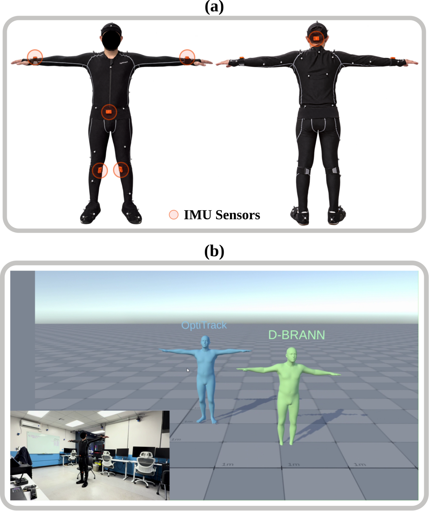

This section covers the datasets, generated tensors, sequence manifests, and SMPL assets used by D-BRANN.

Large datasets and generated training files are not tracked in Git because of their size and licensing restrictions. They must be obtained separately and placed in the expected local directories. Only the small sequence-list manifests (`.txt` files directly under `data/dataset_train/`) are tracked, so directory *names* stay in sync across machines even though the generated tensors themselves don't.

## Directory structure

```text
data/
├── basicmodel_m_lbs_10_207_0_v1.0.0.pkl
├── dataset_raw/
│   ├── AMASS/
│   ├── DIP_IMU/
│   ├── TotalCapture/
│   │   ├── DIP_recalculate/
│   │   └── official/
│   └── dbran_optitrack/            # Custom Xsens captures + Motive CSV exports
│       └── motive_csv/
├── dataset_work/
│   ├── AMASS/
│   ├── DIP_IMU/
│   ├── TotalCapture/
│   └── dbran_optitrack/            # Aligned {acc,ori,pose,tran} dataset
└── dataset_train/
    └── DBRAN_OptiTrack/            # Finalized per-sequence files (with joints, shape)
```

## Raw datasets

D-BRANN currently uses:

- **AMASS** for synthetic sparse-IMU training data
- **DIP-IMU** for real inertial training and validation data
- **TotalCapture** for evaluation
- a **custom OptiTrack + Xsens capture set**, recorded in-house (see below)

The AMASS/DIP-IMU/TotalCapture datasets are not redistributed with this repository. Users are responsible for obtaining them from their official sources and complying with their respective licenses.

## SMPL model

The SMPL model file is not included in this repository. Place the required model at:

```text
data/basicmodel_m_lbs_10_207_0_v1.0.0.pkl
```

The path is configured centrally in `main_path.py`.

## Processed datasets

The base preprocessing script is `scripts/data/preprocess_base_datasets.py`. Processed datasets are written under `data/dataset_work/`.

## Custom OptiTrack + Xsens captures

A custom capture set recorded in-house, using an OptiTrack volume as ground truth alongside six Xsens MTw sensors as the sparse-IMU input.

{fig-alt="(a) Front and back views of a subject in an OptiTrack marker suit with six IMU sensors circled: both wrists, the head, the hip, and both lower legs. (b) A Unity scene showing two avatars in a T-pose, the OptiTrack ground truth in blue and the D-BRANN estimate in green, with an inset photo of the subject in the capture room."}

```text
dataset_raw/dbran_optitrack/
├── captura_XXX.pt                  # Calibrated Xsens capture (xsensDataCapture.py)
├── motive_csv/
│   └── Take_XXX.csv                # Matching Motive export
└── pose_gt.pt                      # extract_optitrack_pose_gt.py output, all takes

dataset_work/dbran_optitrack/
└── train.pt                        # align_and_package_dataset.py output: aligned {acc,ori,pose,tran}

dataset_train/DBRAN_OptiTrack/
└── optitrack_XXX.pt                # finalize_dbran_optitrack_dataset.py output, one per take
```

`captura_XXX.pt` and `Take_XXX.csv` are paired by their shared numeric suffix (`captura_003.pt` ↔ `Take_003.csv`). The remaining stage-specific manifests (`train_pose_dbran_optitrack.txt`, `train_pose_s1_dbran_optitrack.txt`, `train_pose_s2_*_dbran_optitrack.txt`, `train_pose_s3_*_dbran_optitrack.txt`, ...) follow the same naming pattern as the base manifests below, with a `_dbran_optitrack` suffix.

## Staged D-BRANN training data

The final training workflow uses intermediate outputs generated between stages.

### Pose-S1

```text
pose_s1_train/
pose_s1_test/
pose_s1_pred_train/
pose_s1_pred_test/
```

Manifests: `train_pose_s1.txt`, `test_pose_s1.txt`, `train_pose_s1_pred.txt`, `test_pose_s1_pred.txt`

### Pose-S2

```text
pose_s2_gt_train/
pose_s2_gt_test/
pose_s2_train/
pose_s2_test/
pose_s2_pred_train/
pose_s2_pred_test/
```

`pose_s2_gt_*` holds the pure SMPL ground truth used as the Pose-S2 training target; `pose_s2_train`/`pose_s2_test` are the ready-to-train tensors that combine that ground truth with Pose-S1's predicted input.

Manifests: `train_pose_s2_gt.txt`, `test_pose_s2_gt.txt`, `train_pose_s2.txt`, `test_pose_s2.txt`, `train_pose_s2_pred.txt`, `test_pose_s2_pred.txt`

### Pose-S3 and fusion

```text
pose_s3_train/
pose_s3_test/
pose_s3_pred_train/
pose_s3_pred_test/
```

Manifests: `train_pose_s3.txt`, `test_pose_s3.txt`, `train_pose_s3_pred.txt`, `test_pose_s3_pred.txt`

## Base sequence manifests

The main sequence lists are `data/dataset_train/train_pose.txt` and `data/dataset_train/test.txt`.

Every `scripts/data/prepare_*.py` script has a defaults block reproducing the original D-BRANN study's data splits; running it unmodified regenerates the same staged tensors listed above. These scripts always require an explicit `--output_dir`, so a default run never silently overwrites existing staged data — but reusing the same `--output_dir` across two runs does overwrite whatever staged tensors were there before.

See [Evaluation and profiling](evaluation.qmd#smoke-test) for the smoke test that exercises this staged data end to end.

## Important notes

- Dataset directories and generated tensors are excluded through `.gitignore`; only the top-level `.txt` manifests under `data/dataset_train/` are tracked.
- Do not commit proprietary or license-restricted datasets.
- Generated `.pt` files may contain source-path metadata used to match sequences across stages.
- All central data paths are defined in `main_path.py`.
