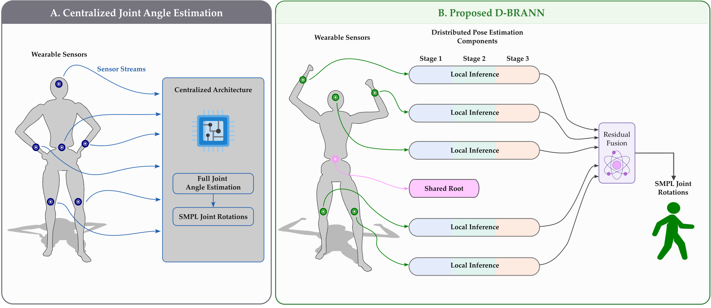
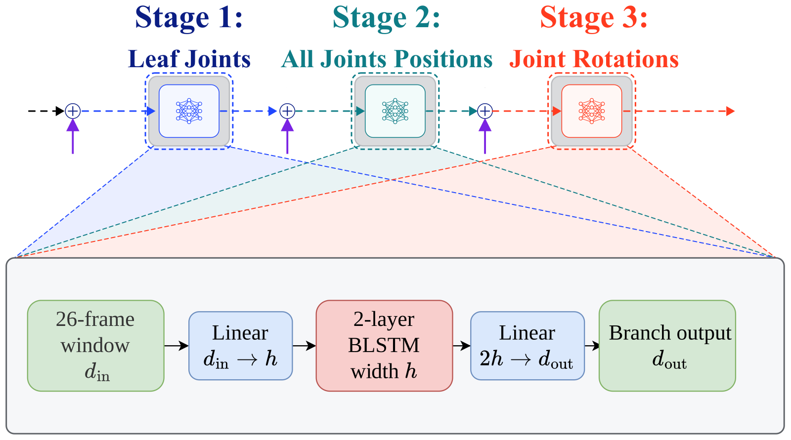
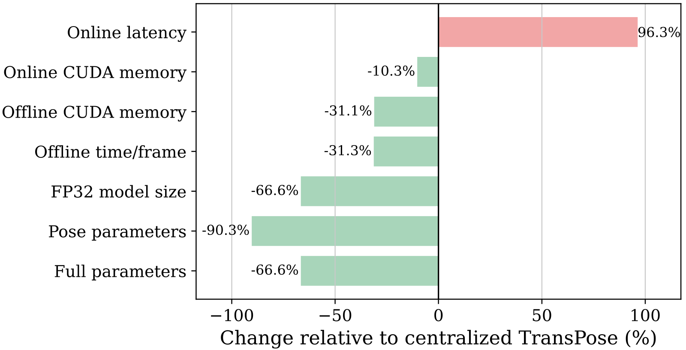

**D-BRANN** is a distributed bidirectional recurrent architecture for full-body human pose estimation from six sparse inertial measurement units (IMUs).

D-BRANN builds on the excellent work of [TransPose](https://github.com/Xinyu-Yi/TransPose) (Yi et al.), whose centralized architecture and translation modules (Trans-B1, Trans-B2) form the foundation this project extends into a distributed, branch-based design.

{fig-alt="Side-by-side comparison: in (A) all wearable sensor streams feed one centralized network that outputs SMPL joint rotations; in (B) each sensor feeds its own three-stage local inference branch, the shared root IMU is shared across branches, and a residual fusion module produces the SMPL joint rotations."}

D-BRANN estimates full-body pose using six IMUs placed on:

- left forearm
- right forearm
- left lower leg
- right lower leg
- head
- root/pelvis

The architecture preserves the staged pose-estimation strategy while distributing the computation across anatomical branches.

{fig-alt="Architecture diagram: the six IMUs (left arm, right arm, left leg, right leg, trunk/head, and the shared hip/root IMU) feed five parallel branches. Each branch runs Stage 1 (leaf joints), Stage 2 (all-joint positions) and Stage 3 (joint rotations). The Stage 3 outputs go to a learned residual fusion module that outputs the full SMPL pose with 24 joints. The translation modules are unchanged."}

The original TransPose `Trans-B1` and `Trans-B2` modules are retained for translation estimation.

## Final architecture

| Stage | Organization | Hidden size | Output |
|---|---:|---:|---|
| Pose-S1 | 5 distributed branches | 32 | Leaf-joint positions |
| Pose-S2 | 5 distributed branches | 16 | Full-joint positions by anatomical branch |
| Pose-S3 | 5 distributed branches | 16 | Reduced-joint 6D rotations by anatomical branch |
| Rotation fusion | Learned residual fusion | 16 | Refined 90-dimensional rotation representation |
| Translation | Original Trans-B1 and Trans-B2 | Original configuration | Root translation |

Pose-S1 uses one local IMU and the shared root IMU for each branch. Pose-S2 and Pose-S3 continue the distributed processing with branch-specific joint subsets. The fusion network refines the assembled Pose-S3 output before conversion to the full SMPL pose.

{fig-alt="Diagram of the three stages (leaf joints, all-joint positions, joint rotations) and, expanded below, the internal structure shared by every stage module: a 26-frame window of dimension d_in, a linear layer d_in to h, a 2-layer bidirectional LSTM of width h, a linear layer 2h to d_out, and the branch output."}

### Parameter count

The current full-pipeline profiler reports:

| Pipeline | Parameters | FP32 parameter size |
|---|---:|---:|
| Original TransPose full pipeline | 4,798,771 | 18.306 MB |
| D-BRANN pose pipeline + original Trans-B1/B2 | 1,603,357 | 6.116 MB |

The resulting parameter ratio is **0.3341**, corresponding to approximately **66.6% fewer parameters** than the original full pipeline.

{fig-alt="Horizontal bar chart of the percentage change of D-BRANN relative to centralized TransPose: online latency +96.3%, online CUDA memory -10.3%, offline CUDA memory -31.1%, offline time per frame -31.3%, FP32 model size -66.6%, pose parameters -90.3%, full parameters -66.6%."}

## Where to go next

- [Repository structure](structure.qmd) — how the codebase is organized
- [Environment](environment.qmd) — set up the Conda environment
- [Checkpoints](checkpoints.qmd) — the validated model weights
- [Data](data.qmd) — datasets, SMPL assets, and staged training tensors
- [Training and data preparation](training.qmd) — the staged training workflow
- [Evaluation and profiling](evaluation.qmd) — running the smoke test and full evaluation
- [Xsens integration](xsens-calibration.qmd) — calibration, live inference, and Unity streaming
