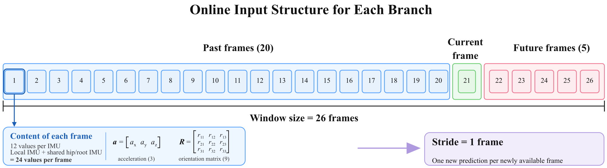

This stage connects the validated Xsens calibration directly to the D-BRANN online pipeline. By default the five anatomical pose branches each run in their own OS process (`DBranParallelPipeline`); the original single-process pipeline (`DBranPipeline`) remains available as a variant.

```{mermaid}
flowchart TD
    A["Six Xsens MTw sensors"] --> B["Native synchronized UDP bridge"]
    B --> C["XsensCalibration.apply_frame()"]
    C --> D["DBranParallelPipeline.forward_online()<br/>(5 branch processes)"]
    D --> E["pose [24, 3, 3] + root translation [3]"]
```

Unity is intentionally not part of this test. The objective is to validate stream integrity, calibrated model input, online inference, output rotations, translation, and the 60 Hz processing budget before introducing another software process.

## Prerequisites

- The native Xsens bridge must compile and stream at 60 Hz.
- `configs/xsens_calibration.json` must exist.
- The six connected MTw IDs must match the calibration.
- `dbran/pipeline_parallel.py` must be validated against `dbran/pipeline.py` (identical pose output, translation within floating-point noise) — see below.
- PyTorch must detect the intended CUDA device.

## First live test

Start the native bridge in one PowerShell terminal:

```powershell
cd C:\Users\kevin\D-BRANN\native\xsens_bridge
.\run.ps1 xsens_stream_bridge
```

Wait for all six MTw sensors and begin measurement.

In another PowerShell terminal:

```powershell
conda activate D-BRAN
cd C:\Users\kevin\D-BRANN

python .\scripts\xsens\run_dbran_live.py `
  --calibration .\configs\xsens_calibration.json `
  --device cuda `
  --pipeline parallel `
  --countdown 8 `
  --max_frames 600 `
  --print_every 60 `
  --save_pt .\data\logs\dbran_live_test.pt
```

`--pipeline parallel` is the default and can be omitted. After pressing ENTER, use the eight-second countdown to adopt the neutral T-pose. Hold it until the script reports that the 26-frame temporal window is ready. Then perform slow, controlled movements.

The script checks:

- 60 Hz stream rate
- synchronized packet counters
- UDP sequence gaps
- calibration time
- D-BRANN inference time
- total processing time
- end-to-end host frame age
- output finiteness
- local-pose rotation validity
- accumulated root translation

## Temporal behavior

The online model uses 20 past frames + the current frame + 5 future frames = 26 frames per branch:

{fig-alt="A row of 26 numbered frames: frames 1 to 20 are past frames, frame 21 is the current frame, and frames 22 to 26 are future frames. Each frame holds 12 values per IMU (3 acceleration values and a 9-value orientation matrix) from the local IMU and the shared hip/root IMU, 24 values in total. The stride is one frame, giving one new prediction per newly available frame."}

At 60 Hz, the five future frames introduce an algorithmic delay of about 83.3 ms. The script separately reports processing time and host-frame age. This applies identically to both pipeline variants — the window logic lives outside the branch computation itself.

The first outputs are generated from a partially initialized window. The script reports a valid full-window output only after all 26 positions have been filled.

## Process-parallel branches (default)

`dbran/pipeline_parallel.py` provides `DBranParallelPipeline`: each of the five anatomical pose branches (left leg, right leg, trunk/head, left arm, right arm) runs in its own OS process instead of inside one process. Translation (Trans-B1/Trans-B2) and residual fusion run in a central orchestrator process.

```{mermaid}
flowchart TD
    A["Orchestrator process<br/>translation + fusion"] -->|"acc/ori window"| B1["Branch process: left_leg"]
    A -->|"acc/ori window"| B2["Branch process: right_leg"]
    A -->|"acc/ori window"| B3["Branch process: trunk_head"]
    A -->|"acc/ori window"| B4["Branch process: left_arm"]
    A -->|"acc/ori window"| B5["Branch process: right_arm"]
    B1 -->|"leaf + S2 + S3 output"| A
    B2 -->|"leaf + S2 + S3 output"| A
    B3 -->|"leaf + S2 + S3 output"| A
    B4 -->|"leaf + S2 + S3 output"| A
    B5 -->|"leaf + S2 + S3 output"| A
```

Each branch process loads only its own three checkpoints (Stage 1, Stage 2, Stage 3) and runs that chain end to end; it never waits on the other four branches. The orchestrator blocks on all five output queues, assembles `leaf_positions`/`full_positions`/the combined Stage-3 output exactly as `DBranPipeline` does internally, then runs fusion and translation unchanged. Data between processes travels as plain CPU tensors over `torch.multiprocessing.Queue` (not CUDA IPC), since consumer-GPU/WDDM Windows does not reliably support CUDA tensor sharing across processes.

```python
from dbran.pipeline_parallel import DBranParallelPipeline

pipeline = DBranParallelPipeline(device="cuda", worker_device="cuda")
output = pipeline.forward_online(acc_frame, ori_frame)   # same return type as DBranPipeline
pipeline.shutdown()                                       # stop the 5 branch processes
```

`run_dbran_live.py` registers `pipeline.shutdown()` with `atexit` automatically, so the five processes are stopped when the script exits.

**Validated against the sequential pipeline** on a synthetic 40-frame sequence: identical pose output (max difference `0.0`) and translation differing only by floating-point noise (`~1.2e-5`), using the exact same checkpoints.

**Known tradeoff.** Measured on this machine: 15.72 ms/frame sequential vs. 15.51 ms/frame with 5 processes (~1.3% faster). Each branch costs only ~0.5-0.6 MFLOPs per step, so the cost of moving tensors between OS processes (serialization, CPU↔GPU copies, five round trips per frame) roughly cancels out the benefit of computing the five branches at the same time. The architecture is genuinely process-parallel and numerically validated; it is not yet a large latency win on this hardware.

## Sequential variant

The original single-process pipeline (`dbran/pipeline.py`, `DBranPipeline`) is still available:

```powershell
python .\scripts\xsens\run_dbran_live.py `
  --device cuda `
  --pipeline sequential `
  --max_frames 600
```

This is the pipeline implementation already validated against `scripts/profile/profile_full_pipeline.py`. Within it, the five branches can additionally run concurrently on separate CUDA streams inside the one process, instead of one after another:

```powershell
python .\scripts\xsens\run_dbran_live.py `
  --device cuda `
  --pipeline sequential `
  --cuda_streams `
  --max_frames 600
```

`--cuda_streams` only has an effect with `--pipeline sequential`; the process-parallel pipeline does not use CUDA streams. Treat either sequential mode as a baseline to compare the process-parallel pipeline against.

## Saving results

When `--save_pt` is provided, the output contains:

- raw local Xsens acceleration
- raw sensor-to-global Xsens orientation
- calibrated acceleration and orientation
- D-BRANN local pose matrices
- root translation
- temporal-window flags
- sequence and packet metadata
- calibration, inference, processing, and host-age measurements

Do not use an unlimited run together with `--save_pt` unless sufficient memory is available.
